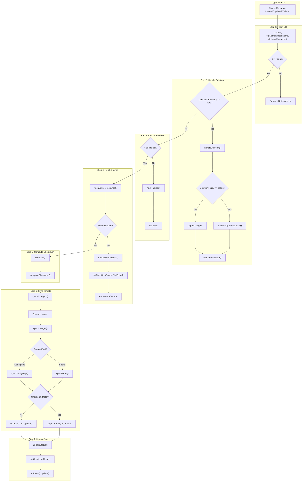

# SharedResource Operator

A Kubernetes operator that synchronizes Secrets and ConfigMaps across namespaces using explicit, auditable intent.

## Problem

Kubernetes namespaces are isolation boundaries, but real clusters often need to share configuration:

- TLS certificates used by multiple services
- Database credentials across microservices
- Feature flags duplicated across environments

Manual copying is error-prone and breaks during secret rotation.

## Solution

Declare sync intent with a `SharedResource` CR:

```yaml
apiVersion: platform.platform.dev/v1alpha1
kind: SharedResource
metadata:
  name: sync-db-credentials
  namespace: security
spec:
  source:
    kind: Secret
    name: db-credentials
  targets:
    - namespace: backend
    - namespace: jobs
  deletionPolicy: orphan
```

The operator continuously syncs the source to all targets.

---

## Architecture

### Reconciliation Loop



---

## Project Structure

```
internal/controller/
├── constants.go              # Annotation keys, finalizer name
├── helpers.go                # computeChecksum(), filterData(), setCondition()
├── sync.go                   # fetchSourceResource(), syncToTarget(), syncSecret(), syncConfigMap()
└── sharedresource_controller.go  # Reconcile(), handleDeletion(), updateStatus()
```

---

## Key Functions

| Function                  | File                         | Purpose                                     |
| ------------------------- | ---------------------------- | ------------------------------------------- |
| `Reconcile()`             | sharedresource_controller.go | Main reconciliation loop entry point        |
| `handleDeletion()`        | sharedresource_controller.go | Finalizer cleanup on CR deletion            |
| `handleSourceError()`     | sharedresource_controller.go | Handle missing source resource              |
| `syncAllTargets()`        | sharedresource_controller.go | Iterate and sync to each target namespace   |
| `updateStatus()`          | sharedresource_controller.go | Update CR status with sync results          |
| `fetchSourceResource()`   | sync.go                      | Get source Secret or ConfigMap data         |
| `syncToTarget()`          | sync.go                      | Orchestrate sync to single target           |
| `syncSecret()`            | sync.go                      | Create/update Secret in target namespace    |
| `syncConfigMap()`         | sync.go                      | Create/update ConfigMap in target namespace |
| `deleteTargetResources()` | sync.go                      | Delete synced resources (delete policy)     |
| `computeChecksum()`       | helpers.go                   | SHA256 hash of data for drift detection     |
| `filterData()`            | helpers.go                   | Apply include/exclude key filters           |
| `setCondition()`          | helpers.go                   | Update status conditions                    |

---

## Annotations on Synced Resources

```yaml
annotations:
  sharedresource.platform.dev/managed-by: sharedresource-operator
  sharedresource.platform.dev/source-namespace: security
  sharedresource.platform.dev/source-name: db-credentials
  sharedresource.platform.dev/source-cr: sync-db-credentials
  sharedresource.platform.dev/checksum: "a1b2c3..."
  sharedresource.platform.dev/last-synced: "2026-01-17T12:00:00Z"
```

---

## Quick Start

```bash
# Install CRDs
make install

# Run operator locally
make run

# Create test resources
kubectl create namespace security
kubectl create namespace backend
kubectl create secret generic db-credentials -n security \
  --from-literal=username=admin \
  --from-literal=password=secret123

# Apply sample SharedResource
kubectl apply -f config/samples/platform_v1alpha1_sharedresource.yaml

# Verify sync
kubectl get secrets db-credentials -n backend -o yaml
```

---

## Design Philosophy

> "Kubernetes avoids cross-namespace secret sharing for good reasons. This operator respects those boundaries while giving teams an explicit, auditable way to synchronize shared configuration."

- **Explicit intent**: No implicit propagation - sync must be declared
- **Auditability**: Annotations track source and sync history
- **Safety**: Orphan deletion policy by default
- **RBAC-aware**: Operator needs explicit permissions per namespace
