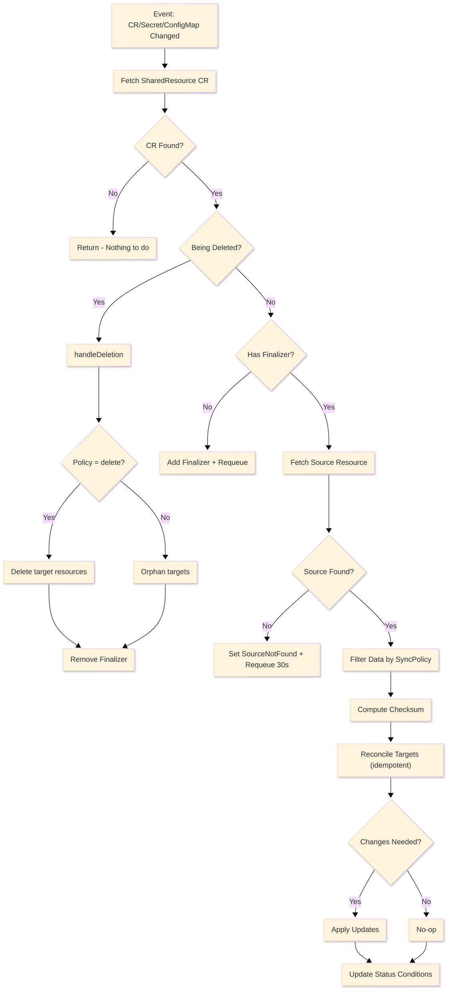

# SharedResource Operator

A Kubernetes operator that synchronizes Secrets and ConfigMaps across namespaces using explicit, auditable intent.

[](LICENSE)

---

## Problem

Kubernetes namespaces are isolation boundaries, but real clusters often need to share configuration:

- TLS certificates used by multiple services
- Database credentials across microservices
- Feature flags duplicated across environments

Manual copying is error-prone and breaks during secret rotation.

---

## Solution

Declare sync intent with a `SharedResource` CR:

```yaml
apiVersion: platform.platform.dev/v1alpha1
kind: SharedResource
metadata:
  name: sync-db-credentials
  namespace: security
spec:
  source:
    kind: Secret
    name: db-credentials
  targets:
    - namespace: backend
    - namespace: jobs
      name: database-creds # Optional: rename in target
  syncPolicy:
    mode: copy # Options: copy | selective | merge
  deletionPolicy: orphan # Options: orphan | delete
```

The operator continuously syncs the source to all targets with:

- **Drift Detection**: Automatic correction when targets are tampered with
- **Checksum-based Updates**: Only updates when data actually changes
- **Auditable Annotations**: Every synced resource tracks its origin

---

## Features

| Feature                | Description                                 |
| ---------------------- | ------------------------------------------- |
| **Multi-target Sync**  | Sync one source to many namespaces          |
| **Rename Support**     | Use different names in different namespaces |
| **Sync Modes**         | `copy`, `selective`, `merge` strategies     |
| **Deletion Policies**  | `orphan` (safe) or `delete` (cleanup)       |
| **Drift Correction**   | Auto-heal tampered targets                  |
| **TLS Secret Support** | Preserves `kubernetes.io/tls` type          |
| **Key Filtering**      | Include/exclude specific keys               |
| **Status Conditions**  | `Ready`, `SourceFound`, `Degraded`          |

---

## Quick Start

```bash
# Install CRDs
make install

# Run operator locally (development)
make run

# Create test resources
kubectl create namespace security
kubectl create namespace backend
kubectl create secret generic db-credentials -n security \
  --from-literal=username=admin \
  --from-literal=password=secret123

# Apply sample SharedResource
kubectl apply -f config/samples/platform_v1alpha1_sharedresource.yaml

# Verify sync
kubectl get secrets db-credentials -n backend -o yaml
```

---

## Production Deployment

### Prerequisites

- Go version v1.24+
- Docker version 17.03+
- kubectl version v1.11.3+
- Access to a Kubernetes v1.11.3+ cluster

### Build and Push Image

```bash
make docker-build docker-push IMG=<your-registry>/sharedresource-operator:v0.1.0
```

### Deploy to Cluster

```bash
# Install CRDs
make install

# Deploy the operator
make deploy IMG=<your-registry>/sharedresource-operator:v0.1.0
```

> **NOTE**: If you encounter RBAC errors, you may need to grant yourself cluster-admin privileges.

### Verify Deployment

```bash
kubectl get pods -n k8s-operator-system
kubectl apply -k config/samples/
```

---

## Uninstall

```bash
# Delete sample resources
kubectl delete -k config/samples/

# Undeploy the operator
make undeploy

# Remove CRDs
make uninstall
```

---

## API Reference

### SharedResourceSpec

| Field            | Type              | Required | Default        | Description                          |
| ---------------- | ----------------- | -------- | -------------- | ------------------------------------ |
| `source`         | `SourceSpec`      | ✅       | -              | The Secret or ConfigMap to sync from |
| `targets`        | `[]TargetSpec`    | ✅       | -              | List of namespaces to sync to        |
| `syncPolicy`     | `*SyncPolicySpec` | ❌       | `{mode: copy}` | How to filter/transform data         |
| `deletionPolicy` | `string`          | ❌       | `orphan`       | What happens on CR deletion          |

### SourceSpec

| Field  | Type     | Required | Description                                               |
| ------ | -------- | -------- | --------------------------------------------------------- |
| `kind` | `string` | ✅       | `Secret` or `ConfigMap`                                   |
| `name` | `string` | ✅       | Name of source resource (must be in same namespace as CR) |

### TargetSpec

| Field       | Type     | Required | Description                              |
| ----------- | -------- | -------- | ---------------------------------------- |
| `namespace` | `string` | ✅       | Target namespace (must already exist)    |
| `name`      | `string` | ❌       | Override resource name in this namespace |

### SyncPolicySpec

| Field  | Type           | Required | Default | Description                          |
| ------ | -------------- | -------- | ------- | ------------------------------------ |
| `mode` | `string`       | ❌       | `copy`  | `copy`, `selective`, or `merge`      |
| `keys` | `*KeySelector` | ❌       | -       | Key filtering (for `selective` mode) |

### KeySelector

| Field     | Type       | Description                             |
| --------- | ---------- | --------------------------------------- |
| `include` | `[]string` | Only sync these keys                    |
| `exclude` | `[]string` | Skip these keys (applied after include) |

---

## Sync Modes

### Copy Mode (Default)

Target data = Source data exactly. Overwrites everything.

```yaml
syncPolicy:
  mode: copy
```

### Selective Mode

Only sync specific keys using include/exclude filters.

```yaml
syncPolicy:
  mode: selective
  keys:
    include:
      - username
      - password
    exclude:
      - internal-metadata
```

### Merge Mode

Source keys are synced, but extra keys in target are preserved.

```yaml
syncPolicy:
  mode: merge
```

**Use case**: Target namespace adds local keys that shouldn't be overwritten.

---

## Deletion Policies

### Orphan (Default)

Target resources are left in place when the `SharedResource` CR is deleted.

- ✅ Safe for production
- ✅ Running workloads continue working

### Delete

Target resources are removed when the `SharedResource` CR is deleted.

- ⚠️ Use with caution
- ⚠️ May break running workloads

---

## Status & Conditions

Check sync health:

```bash
kubectl get sharedresource sync-db-credentials -n security -o yaml
```

### Conditions

| Type          | Status  | Meaning                               |
| ------------- | ------- | ------------------------------------- |
| `Ready`       | `True`  | All targets synced successfully       |
| `Ready`       | `False` | Sync failed (see message)             |
| `SourceFound` | `True`  | Source Secret/ConfigMap exists        |
| `SourceFound` | `False` | Source not found                      |
| `Degraded`    | `True`  | Partial failure (some targets failed) |

### Status Fields

```yaml
status:
  conditions: [...]
  syncedTargets:
    - namespace: backend
      name: db-credentials
      synced: true
      lastSynced: "2026-01-19T10:00:00Z"
    - namespace: jobs
      name: database-creds
      synced: false
      error: "namespace not found"
  lastSyncTime: "2026-01-19T10:00:00Z"
  sourceChecksum: "a1b2c3d4..."
```

---

## Architecture

### Reconciliation Flow



### Watch Strategy

The operator watches three resource types:

1. **SharedResource CRs**: Primary reconciliation trigger
2. **Secrets**: Detect source changes and target tampering
3. **ConfigMaps**: Same as Secrets

When a Secret/ConfigMap changes, the operator uses annotations to determine if it's a **Source** (propagate changes) or a **Target** (drift correction).

---

## Project Structure

```
├── api/v1alpha1/
│   └── sharedresource_types.go    # CRD definition
├── internal/controller/
│   ├── constants.go               # Annotations, finalizer, conditions
│   ├── helpers.go                 # checksum, filterData, setCondition
│   ├── sync.go                    # fetchSource, syncSecret, syncConfigMap
│   └── sharedresource_controller.go  # Reconcile, watches, status
├── config/
│   ├── crd/                       # Generated CRD manifests
│   ├── rbac/                      # Generated RBAC rules
│   └── samples/                   # Example SharedResource YAMLs
└── test/
    └── e2e/                       # End-to-end tests (Kind cluster)
```

---

## Annotations on Synced Resources

Every target resource is stamped with tracking annotations:

```yaml
annotations:
  sharedresource.platform.dev/managed-by: sharedresource-operator
  sharedresource.platform.dev/source-namespace: security
  sharedresource.platform.dev/source-name: db-credentials
  sharedresource.platform.dev/source-cr: sync-db-credentials
  sharedresource.platform.dev/checksum: "a1b2c3..."
  sharedresource.platform.dev/last-synced: "2026-01-19T10:00:00Z"
```

These enable:

- **Drift Detection**: Compare checksums to detect tampering
- **Audit Trail**: Track where data came from
- **Safe Deletion**: Only delete resources we created

---

## Testing

### Integration Tests (Fast, uses envtest)

```bash
make test
```

Runs ~20 tests covering all sync modes, filtering, drift detection, and deletion policies.

### E2E Tests (Slow, requires Kind cluster)

```bash
make test-e2e
```

Runs against a real Kubernetes cluster to verify deployment and sync behavior.

---

## Development

### Prerequisites

- Go 1.24+
- Docker
- kubectl
- Kind (for E2E tests)

### Using DevContainer

Open in VS Code with Dev Containers extension for a pre-configured environment with all tools installed.

### Make Targets

| Command             | Description              |
| ------------------- | ------------------------ |
| `make install`      | Install CRDs to cluster  |
| `make run`          | Run operator locally     |
| `make test`         | Run integration tests    |
| `make test-e2e`     | Run E2E tests (Kind)     |
| `make lint`         | Run linter               |
| `make manifests`    | Regenerate CRDs and RBAC |
| `make docker-build` | Build operator image     |
| `make deploy`       | Deploy to cluster        |

---

## Security Considerations

1. **Same-Namespace Enforcement**: Source must be in the same namespace as the CR. You cannot sync secrets from namespaces you don't control.

2. **RBAC-Aware**: The operator needs explicit permissions to read sources and write targets. Cluster admins control which namespaces are accessible.

3. **Finalizer Safety**: The `orphan` deletion policy (default) ensures secrets aren't accidentally deleted when experimenting with CRs.

4. **Managed-By Check**: On deletion, the operator only removes resources with its own `managed-by` annotation.

---

## Design Philosophy

> "Kubernetes avoids cross-namespace secret sharing for good reasons. This operator respects those boundaries while giving teams an explicit, auditable way to synchronize shared configuration."

- **Explicit Intent**: No implicit propagation - sync must be declared
- **Auditability**: Annotations track source and sync history
- **Safety First**: Orphan deletion policy by default
- **RBAC-Aware**: Operator needs explicit permissions per namespace
- **Self-Healing**: Drift detection corrects unauthorized changes

---

## Installation

Install the operator in your cluster:

```bash
kubectl apply -f https://github.com/Vijay-papanaboina/sharedresource-operator/releases/download/v0.1.0/install.yaml
```

---

## Building from Source

For maintainers or those who want to customize:

```bash
# Build and push your own image
make docker-build docker-push IMG=<your-registry>/sharedresource-operator:v0.1.0

# Generate the install.yaml with your image
make build-installer IMG=<your-registry>/sharedresource-operator:v0.1.0

# Deploy your custom bundle
kubectl apply -f dist/install.yaml
```

---

## License

Apache License 2.0
